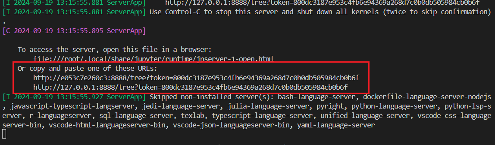

# HDFS cluster and Spark Jupyter Notebook with Docker

## Getting Started
### Prerequisites
- docker
- docker-compose

### HDFS Setup
Start the HDFS cluster:
```bash
cd hdfs-docker-cluster
docker-compose up -d
```

You can access the HDFS Namenode web interface at http://localhost:9870.

Run the load_dataset_to_hdfs.sh script to load the dataset to HDFS (if you are on Windows, run the commands in the script manually).

### Spark Jupyter Notebook Setup
Start the Spark Jupyter Notebook:
```bash
cd spark-docker-image
docker run -it -p 8888:8888 -v .:/notebooks --network hdfs-docker-cluster_hdfs_network sfabio01/spark-python-jupyter
```

This will start a Jupyter Notebook server. To access the notebook interface, open the link outputted by the command.



Run the getting_started.ipynb notebook to verify the setup.
